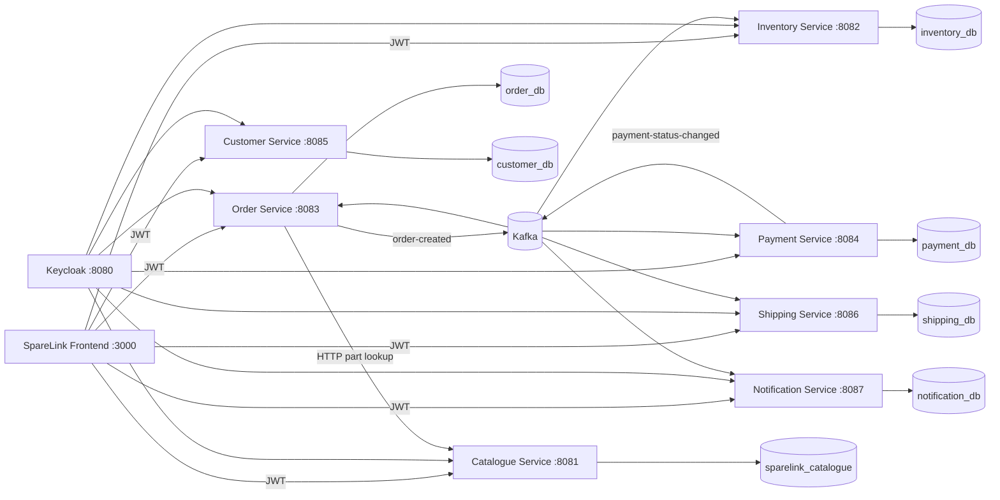

# SpareLink Platform

[](https://github.com/tadiwanashe-mashongwa/sparelink-platform/actions/workflows/ci.yml)

Local integration environment for the SpareLink automotive spare-parts microservices.

## Architecture



Each service owns its own database. The seven databases run in one local PostgreSQL container only for development convenience.

See [the architecture guide](docs/architecture.md) for the request sequence, database ER diagrams, and testing strategy.

## Start

Create local credentials before starting the stack. `.env` is ignored by Git; use strong values outside local development.

```powershell
Copy-Item .env.example .env
```

```powershell
docker compose up --build -d
```

Stop the local stack:

```powershell
docker compose down
```

If you already created the PostgreSQL volume before Payment Service, Customer Service, or Shipping Service was added, create their databases once before starting the updated stack:

```powershell
docker compose exec postgres createdb -U postgres payment_db
docker compose exec postgres createdb -U postgres customer_db
docker compose exec postgres createdb -U postgres shipping_db
docker compose exec postgres createdb -U postgres notification_db
```

## Local endpoints

| Component | URL |
| --- | --- |
| Frontend PWA | http://localhost:3000 |
| Keycloak | http://localhost:8080 |
| Catalogue API | http://localhost:8081 |
| Inventory API | http://localhost:8082 |
| Order API | http://localhost:8083 |
| Payment API | http://localhost:8084 |
| Payment OpenAPI | http://localhost:8084/swagger-ui/index.html |
| Customer API | http://localhost:8085 |
| Customer OpenAPI | http://localhost:8085/swagger-ui/index.html |
| Shipping API | http://localhost:8086 |
| Shipping OpenAPI | http://localhost:8086/swagger-ui/index.html |
| Notification API | http://localhost:8087 |
| Notification OpenAPI | http://localhost:8087/swagger-ui/index.html |
| PostgreSQL | localhost:5435 |

Health endpoints:

```text
http://localhost:8081/actuator/health
http://localhost:8082/actuator/health
http://localhost:8083/actuator/health
http://localhost:8084/actuator/health
http://localhost:8085/actuator/health
http://localhost:8086/actuator/health
http://localhost:8087/actuator/health
```

## Keycloak development users

| User | Password | Role |
| --- | --- | --- |
| `customer` | `customer` | `CUSTOMER` |
| `admin` | `admin` | `ADMIN` |

The development OAuth client is `sparelink-api`.

## Frontend

The customer PWA lives in its own repository: [sparelink-frontend](https://github.com/tadiwanashe-mashongwa/sparelink-frontend). It is included in this Compose stack at http://localhost:3000 and proxies catalogue and order API requests internally.

## Verified smoke flow

The platform smoke test exercises this authenticated request flow:

1. Create a Catalogue part and add Inventory stock.
2. Create an order as the Keycloak `customer` user.
3. Order Service retrieves the part price from Catalogue.
4. Order Service writes and publishes an `order-created` event through Kafka.
5. Inventory consumes the event and reserves stock (verified quantity: `5 → 3`).
6. Payment Service consumes the order event and creates a pending payment.
7. A successful payment publishes `payment-status-changed`, which transitions the order to `PAID`.
8. Shipping Service consumes `order-created` and `payment-status-changed SUCCESS`, then creates one `PENDING` shipment.
9. Notification Service consumes the order and successful payment events, then creates one unread `PAYMENT_SUCCEEDED` notification for the customer.

The failure path is also verified: a failed payment publishes `payment-status-changed`, Order Service transitions the order to `PAYMENT_FAILED`, and Inventory releases the reservation (verified quantity: `3 → 5`).

Kafka runs in single-node KRaft mode with consumer-group support enabled.

Run the verified smoke test against a running stack:

```powershell
.\scripts\smoke-test.ps1
.\scripts\smoke-test.ps1 -PaymentStatus FAILED
```
