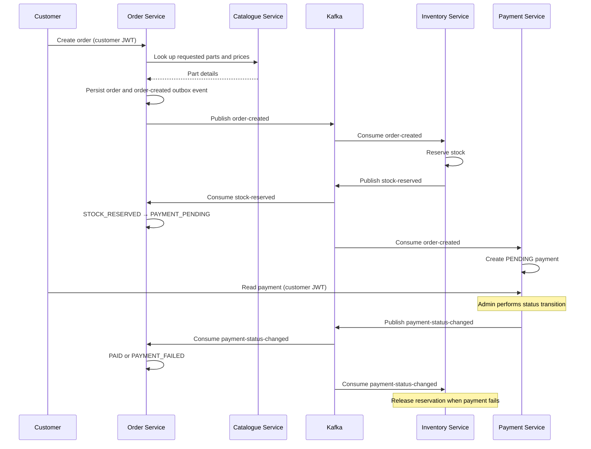
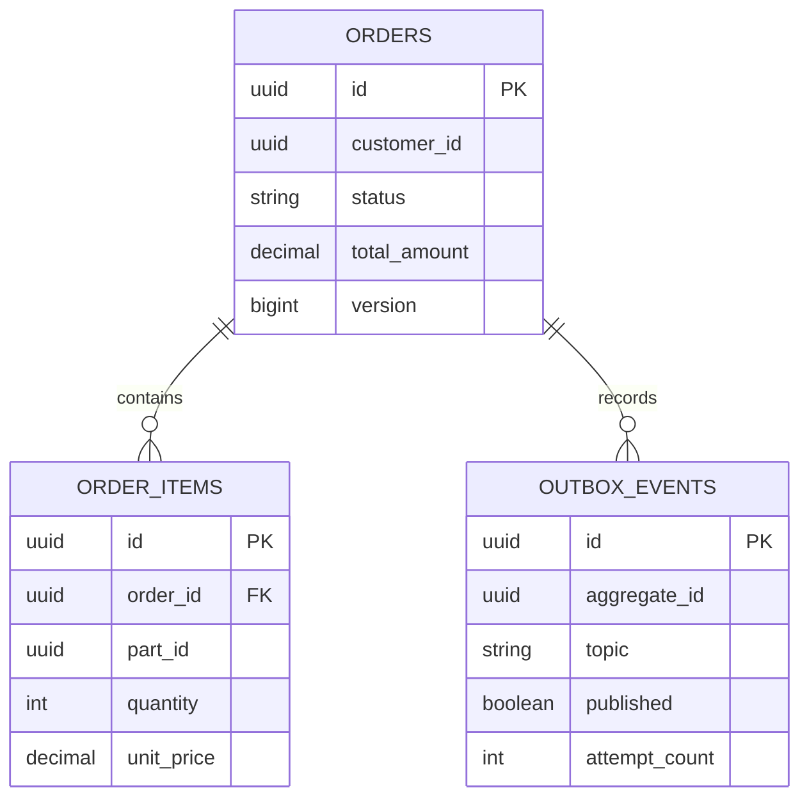
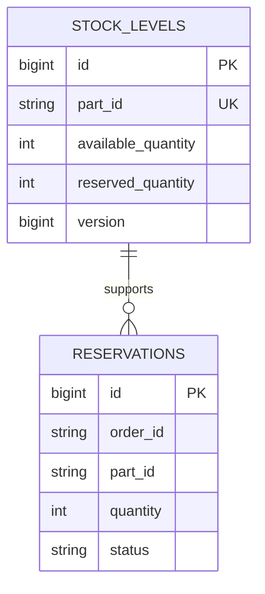
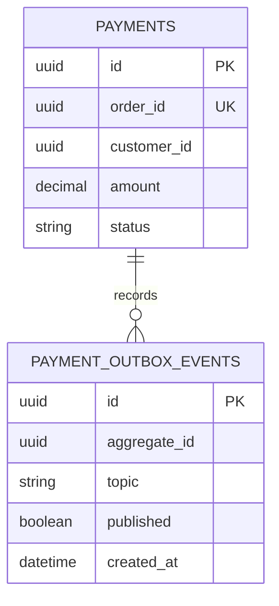
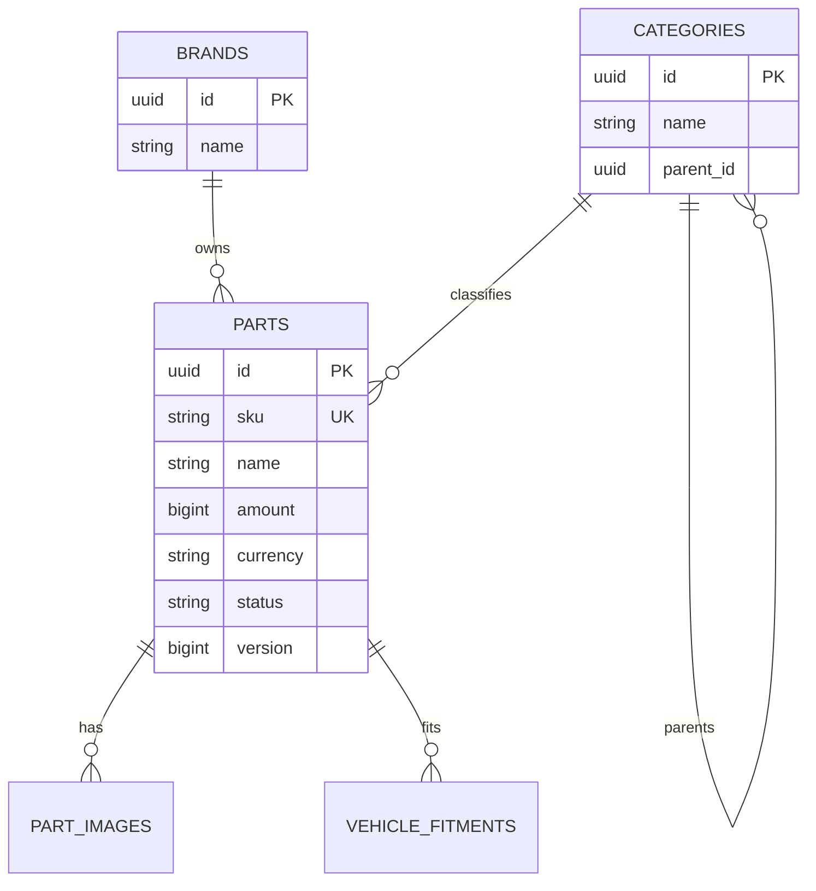

# SpareLink Architecture

## Order-to-payment sequence



## Database ownership

Every service owns its database. The shared PostgreSQL container in local Docker Compose is an infrastructure convenience, not a shared data model.









## Testing strategy

| Layer | Purpose | Technology |
| --- | --- | --- |
| Domain and service tests | Business rules, idempotency, and valid state transitions | JUnit 5, Mockito |
| Controller tests | HTTP validation, response contracts, and role-based access | MockMvc, Spring Security Test |
| Repository tests | Flyway schema, JPA mappings, queries, pagination, and constraints | PostgreSQL Testcontainers |
| Integration tests | Kafka events, transactional outbox relays, Feign behaviour, and persistence | Spring Boot, Kafka/PostgreSQL Testcontainers, WireMock |
| Platform smoke tests | Authenticated happy and failure paths across all services | Docker Compose, PowerShell |

Run the platform flows after starting Docker Compose:

```powershell
.\scripts\smoke-test.ps1
.\scripts\smoke-test.ps1 -PaymentStatus FAILED
```
